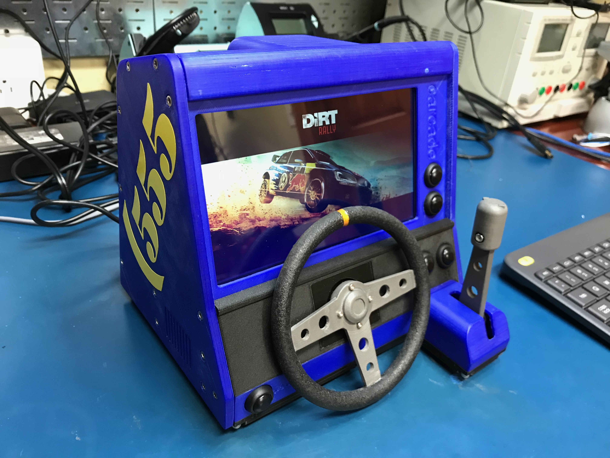

# Dirt Rally car-cade

Desktop car arcade machine running SteamOS. 

I am currently working on the content for this project and will publish a HOWTO guide for how to 3d print and assemble your own car-cade, including a step by step guide to make everything work in SteamOS.

All of the models to print your own can be found in enclosure/stl.

You can read my blog post about the car-cade here: http://projectable.me/my-dirt-rally-tabletop-car-cade-game/

## Hardware needed
* Asus H110S2 motherboard
* Intel G4500 CPU
* 8G Ram
* 512G SSD
* Pimoroni Picade PCB
* Adafruit 3W speakers
* 10k linear potentiometers
* Buttons
* 3D printer to print the enclosure

## Operating System
* [SteamOS](http://store.steampowered.com/steamos/buildyourown)
